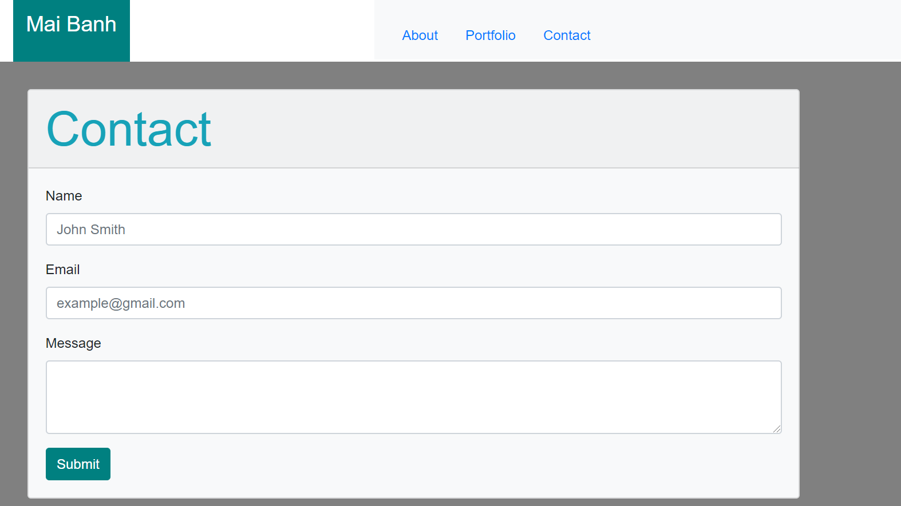

# Responsive-Portfolio

## About the project
Utilizing Bootstrap's reponsive CSS Framework, I created a mobile reponsive portfolio with the following three pages: About me, Contact and Portfolio.

---

## Getting started 
Below are the prerequisite understanding and programs that were utilized :

* Visual Studio Code-click [here](https://code.visualstudio.com/) to a tutorial to install
* Github repository-click [here](https://help.github.com/en/github/getting-started-with-github/create-a-repo) for tutorial to clone repository
* An understanding of Bootstrap's grid system. Click [here](https://getbootstrap.com/docs/4.5/layout/grid/) for a quick tutorial
* Employ Bootstrap starter template to html document. Click [here](https://getbootstrap.com/docs/4.5/getting-started/introduction/) for the template

---

## Built with
[HTML] (https://www.w3schools.com/TAGS/default.ASP)
[CSS] (https://www.w3schools.com/css/css_howto.asp)
[Bootstrap] (https://getbootstrap.com/docs/4.5/content/reboot/)

---

## Live Site
Below is a screenshot of the Contact page 

---

## Deployed Link

[See live site] (https://mtbanh.github.io/Responsive-Portfolio/)

## Author

**Mai Banh**

- [Link to Portfolio Site](#)
- [Link to Github](https://github.com/mtbanh)
- [Link to LinkedIn](https://www.linkedin.com/in/mai-banh-311ba6164/)

See also the list of [contributors](https://github.com/your/project/contributors) who participated in this project.

---

## License

This project is licensed under the MIT License 

---

## Acknowledgments
Thank you to everyone who have helped out!

